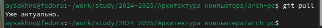
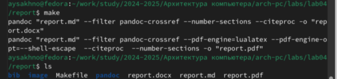
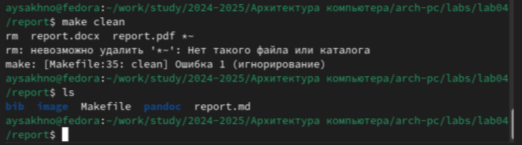
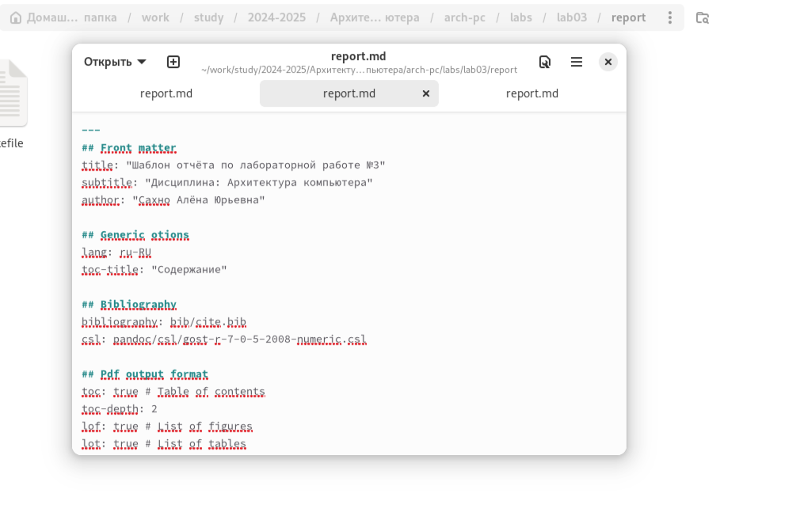
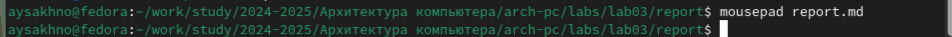
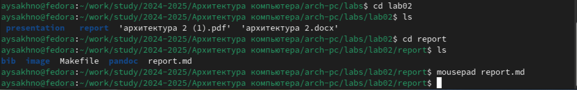
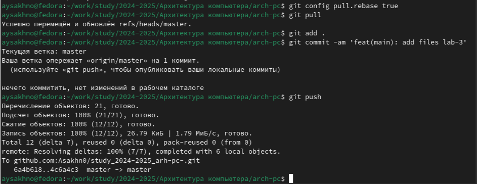

---
## Front matter
title: "Шаблон отчёта по лабораторной работе №3"
subtitle: "Дисциплина: Архитектура компьютера"
author: "Сахно Алёна Юрьевна"

## Generic otions
lang: ru-RU
toc-title: "Содержание"

## Bibliography
bibliography: bib/cite.bib
csl: pandoc/csl/gost-r-7-0-5-2008-numeric.csl

## Pdf output format
toc: true # Table of contents
toc-depth: 2
lof: true # List of figures
lot: true # List of tables
fontsize: 12pt
linestretch: 1.5
papersize: a4
documentclass: scrreprt
## I18n polyglossia
polyglossia-lang:
  name: russian
  options:
	- spelling=modern
	- babelshorthands=true
polyglossia-otherlangs:
  name: english
## I18n babel
babel-lang: russian
babel-otherlangs: english
## Fonts
mainfont: IBM Plex Serif
romanfont: IBM Plex Serif
sansfont: IBM Plex Sans
monofont: IBM Plex Mono
mathfont: STIX Two Math
mainfontoptions: Ligatures=Common,Ligatures=TeX,Scale=0.94
romanfontoptions: Ligatures=Common,Ligatures=TeX,Scale=0.94
sansfontoptions: Ligatures=Common,Ligatures=TeX,Scale=MatchLowercase,Scale=0.94
monofontoptions: Scale=MatchLowercase,Scale=0.94,FakeStretch=0.9
mathfontoptions:
## Biblatex
biblatex: true
biblio-style: "gost-numeric"
biblatexoptions:
  - parentracker=true
  - backend=biber
  - hyperref=auto
  - language=auto
  - autolang=other*
  - citestyle=gost-numeric
## Pandoc-crossref LaTeX customization
figureTitle: "Рис."
tableTitle: "Таблица"
listingTitle: "Листинг"
lofTitle: "Список иллюстраций"
lotTitle: "Список таблиц"
lolTitle: "Листинги"
## Misc options
indent: true
header-includes:
  - \usepackage{indentfirst}
  - \usepackage{float} # keep figures where there are in the text
  - \floatplacement{figure}{H} # keep figures where there are in the text
---

# Цель работы
Целью данной лабораторной работы является освоение процедуры оформления отчетов с помощью легковесного языка разметки Markdown.

# Задание
> Установка необходимого ПО
> Заполнение отчета по выполнению лабораторной работы №4 с помощью языка разметки Markdown
> Задание для самостоятельной работы
# Теоретическое введение

Markdown — облегчённый язык разметки, созданный с целью обозначения форматирования в простом тексте, с максимальным сохранением его читаемости человеком, и пригодный для машинного преобразования в языки для продвинутых публикаций (HTML, Rich Text и других).
# Выполнение лабораторной работы

Обновите локальный репозиторий, скачав изменения из удаленного репозитория с помощью команды 
git pull 

([-@fig:001]):

{#fig:001 width=70%}

3.Перейдите в каталог с шаблоном отчета по лабораторной работе № 3 
cd ~/work/study/2023-2024/"Архитектура компьютера"/arch-pc/labs/lab03/report 
 
4. Проведите компиляцию шаблона с использованием Makefile. Для этого введите команду
 make 
 
([-@fig:002]):

{#fig:002 width=70%}

При успешной компиляции должны сгенерироваться файлы report.pdf и report.docx. Откройте и проверьте корректность полученных файлов. 
 
Удалите полученный файлы с использованием Makefile. Для этого введите команду
 make clean 
 
([-@fig:003]):

{#fig:003 width=70%}

Проверьте, что после этой команды файлы report.pdf и report.docx были удалены. 
 
6. Откройте файл report.md c помощью любого текстового редактора, например gedit
 gedit report.md 
 
([-@fig:004]):

{#fig:004 width=70%}

Внимательно изучите структуру этого файла.

7. Заполните отчет и скомпилируйте отчет с использованием Makefile. Проверьте корректность полученных файлов. (Обратите внимание, для корректного отображения скриншотов они должны быть размещены в каталоге image)

 8. Загрузите файлы на Github. 
cd ~/work/study/2023-2024/"Архитектура компьютера"/arch-pc
 git add . 
git commit -am 'feat(main): add files lab-3' 
git push

# Задание для самостоятельной работы

1.     По заданию я в соответствующем каталоге делаю отчёт по лабораторной работе № 2 в формате Markdown. Для этого перехожу в директорию 2 лабораторной работы и готовлю отчет с помощью текстового редактора mousepad

 ([-@fig:005]):

{#fig:005 width=70%}

Загрузите файлы на github.

 ([-@fig:006]):

{#fig:006 width=70%}

 ([-@fig:007]):

{#fig:007 width=70%}

# Выводы
В результате данной лабораторной работе я освоила процедуры оформления отчетов с помощью легковесного языка разметки Markdown.

# Список литературы{.unnumbered}

::: {#refs}
:::https://esystem.rudn.ru/
