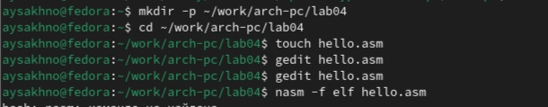
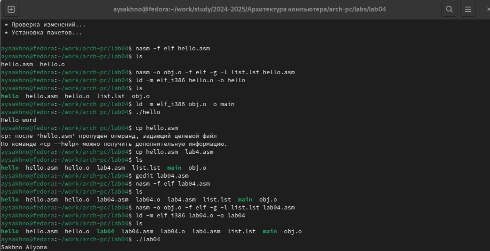
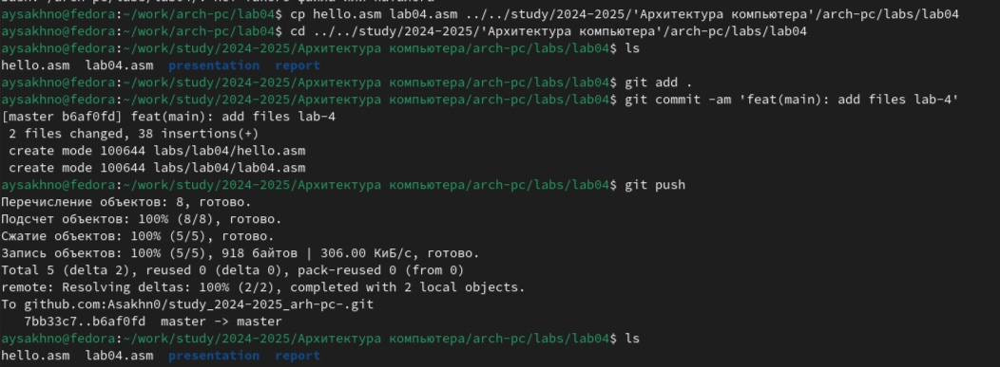

---
## Front matter
title: "Шфблон отчёт по лабораторной работе №4"
subtitle: "Дисциплина: Архитектура компьютера"
author: "Сахно Алёна Юрьевна"

## Generic otions
lang: ru-RU
toc-title: "Содержание"

## Bibliography
bibliography: bib/cite.bib
csl: pandoc/csl/gost-r-7-0-5-2008-numeric.csl

## Pdf output format
toc: true # Table of contents
toc-depth: 2
lof: true # List of figures
lot: true # List of tables
fontsize: 12pt
linestretch: 1.5
papersize: a4
documentclass: scrreprt
## I18n polyglossia
polyglossia-lang:
  name: russian
  options:
	- spelling=modern
	- babelshorthands=true
polyglossia-otherlangs:
  name: english
## I18n babel
babel-lang: russian
babel-otherlangs: english
## Fonts
mainfont: IBM Plex Serif
romanfont: IBM Plex Serif
sansfont: IBM Plex Sans
monofont: IBM Plex Mono
mathfont: STIX Two Math
mainfontoptions: Ligatures=Common,Ligatures=TeX,Scale=0.94
romanfontoptions: Ligatures=Common,Ligatures=TeX,Scale=0.94
sansfontoptions: Ligatures=Common,Ligatures=TeX,Scale=MatchLowercase,Scale=0.94
monofontoptions: Scale=MatchLowercase,Scale=0.94,FakeStretch=0.9
mathfontoptions:
## Biblatex
biblatex: true
biblio-style: "gost-numeric"
biblatexoptions:
  - parentracker=true
  - backend=biber
  - hyperref=auto
  - language=auto
  - autolang=other*
  - citestyle=gost-numeric
## Pandoc-crossref LaTeX customization
figureTitle: "Рис."
tableTitle: "Таблица"
listingTitle: "Листинг"
lofTitle: "Список иллюстраций"
lotTitle: "Список таблиц"
lolTitle: "Листинги"
## Misc options
indent: true
header-includes:
  - \usepackage{indentfirst}
  - \usepackage{float} # keep figures where there are in the text
  - \floatplacement{figure}{H} # keep figures where there are in the text
---

# Цель работы

Освоение процедуры компиляции и сборки программ, написанных на ассемблере NASM.

# Задание

1. Создание программы Hello world!
2. Работа с транслятором NASM
3. Работа с расширенным синтаксисом командной строки NASM
4. Работа с компоновщиком LD
5. Запуск исполняемого файла
6. Выполнение заданий для самостоятельной работы.

# Теоретическое введение

Основные принципы работы компьютера
 Основными функциональными элементами любой электронно-вычислительной машины (ЭВМ) являются центральный процессор, память и периферийные устройства (рис. 4.1). 
Взаимодействие этих устройств осуществляется через общую шину, к которой они подключены. Физически шина представляет собой большое количество проводников, соединяющих устройства друг с другом. В современных компьютерах проводники выполнены в виде электропроводящих дорожек на материнской (системной) плате. 
Основной задачей процессора является обработка информации, а также организация координации всех узлов компьютера. В состав центрального процессора (ЦП) входят следующие устройства: 
 
• арифметико-логическое устройство (АЛУ) — выполняет логические и арифметические действия, необходимые для обработки информации, хранящейся в памяти; 
• устройство управления (УУ) — обеспечивает управление и контроль всех устройств компьютера; 
• регистры — сверхбыстрая оперативная память небольшого объёма, входящая в состав процессора, для временного хранения промежуточных результатов выполнения инструкций; регистры процессора делятся на два типа: регистры общего назначения и специальные регистры.
 
 Для того, чтобы писать программы на ассемблере, необходимо знать, какие регистры процессора существуют и как их можно использовать. Большинство команд в программах написанных на ассемблере используют регистры в качестве операндов. Практически все команды представляют собой преобразование данных хранящихся в регистрах процессора, это например пересылка данных между регистрами или между регистрами и памятью, преобразование (арифметические или логические операции) данных хранящихся в регистрах. 
Доступ к регистрам осуществляется не по адресам, как к основной памяти, а по именам. 
Каждый регистр процессора архитектуры x86 имеет свое название, состоящее из 2 или 3 букв латинского алфавита.
 В качестве примера приведем названия основных регистров общего назначения (именно эти регистры чаще всего используются при написании программ):
• RAX, RCX, RDX, RBX, RSI, RDI — 64-битные 
• EAX, ECX, EDX, EBX, ESI, EDI — 32-битные 
• AX, CX, DX, BX, SI, DI — 16-битные
 • AH, AL, CH, CL, DH, DL, BH, BL — 8-битные (половинки 16-битных регистров). Например, AH (high AX) — старшие 8 бит регистра AX, AL (low AX) — младшие 8 бит регистра AX.

# Порядок выполнения лабораторной работы 
Программа Hello world!
Cоздайте каталог для работы с программами на языке ассемблера NASM:
mkdir -p ~/work/arch-pc/lab04

Перейдите в созданный каталог
cd ~/work/arch-pc/lab04

Создайте текстовый файл с именем hello.asm
touch hello.asm

откройте этот файл с помощью любого текстового редактора, например, gedit
gedit hello.asm

и введите в него следующий текст:

NASM превращает текст программы в объектный код. Например, для компиляции приве-
дённого выше текста программы «Hello World» необходимо написать:
nasm -f elf hello.asm (рис.1 [-@fig:001]):

{#fig:001 width=70% }

Полный вариант командной строки nasm выглядит следующим образом:

nasm [-@ косвенный_файл_настроек] [-o объектный_файл] [-f ↪ 
формат_объектного_файла] [-l листинг] [параметры...] [--] исходный_файл

Выполните следующую команду:
nasm -o obj.o -f elf -g -l list.lst hello.asm

 исполняемую программу, объектный файл
необходимо передать на обработку компоновщику:
ld -m elf_i386 hello.o -o hello

Ключ -o с последующим значением задаёт в данном случае имя создаваемого исполняе-
мого файла.
Выполните следующую команду:
ld -m elf_i386 obj.o -o main

Запустить на выполнение созданный исполняемый файл, находящийся в текущем каталоге,
можно, набрав в командной строке:
./hello

# Задание для самостоятельной работы
1. В каталоге ~/work/arch-pc/lab04 с помощью команды cp создайте копию файла
hello.asm с именем lab4.asm

2. С помощью любого текстового редактора внесите изменения в текст программы в
файле lab4.asm так, чтобы вместо Hello world! на экран выводилась строка с вашими
фамилией и именем.
3. Оттранслируйте полученный текст программы lab4.asm в объектный файл. Выполните

компоновку объектного файла и запустите получившийся исполняемый файл.
(рис.2 [-@fig:002]):

{#fig:003 width=70% }

4. Скопируйте файлы hello.asm и lab4.asm в Ваш локальный репозиторий в ката-
лог ~/work/study/2023-2024/"Архитектура компьютера"/arch-pc/labs/lab04/.
Загрузите файлы на Github.
(рис.3[-@fig:003]):

{#fig:004 width=70% }

# Выводы
Я освоила процедуры компиляции и сборки программ, написанных на ассемблере NASM.

# Список литературы{.unnumbered}

::: {#refs}
:::https://esystem.rudn.ru/pluginfile.php/2089084/mod_resource/content/0/Лабораторная%20работа%20№4.%20Создание%20и%20процесс%20обработки%20программ%20на%20языке%20ассемблера%20NASM.pdf
