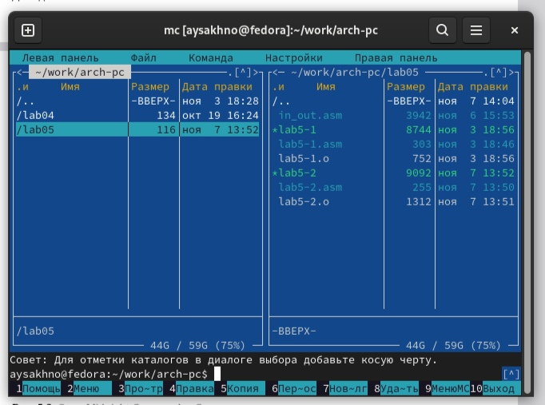
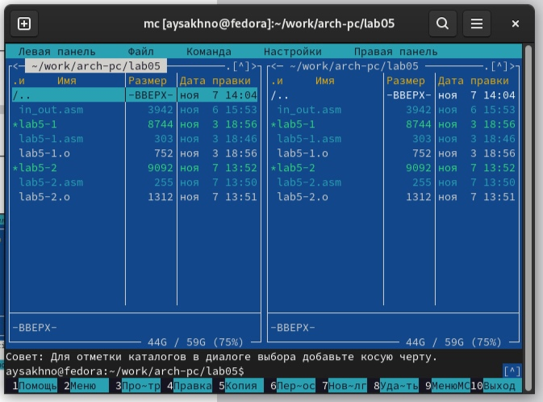
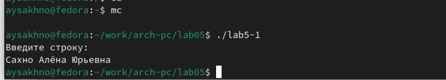
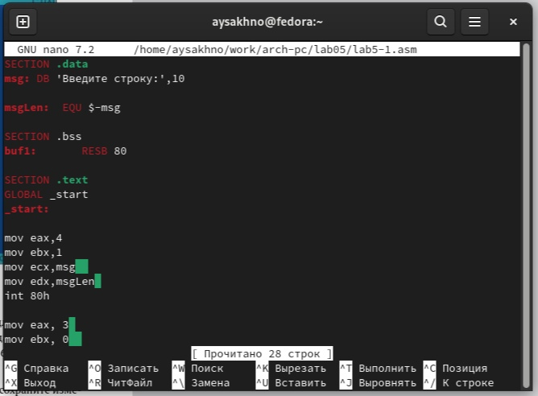
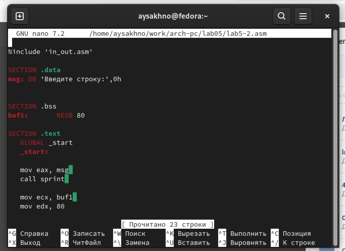
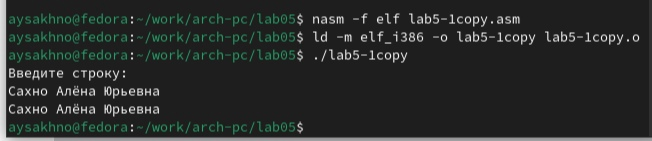
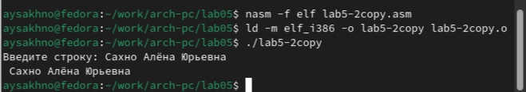

---
## Front matter
title: "Шаблон отчёта по лабораторной работе №5"
subtitle: "Простейший вариант"
author: "Сахно Алёна Юрьевна"

## Generic otions
lang: ru-RU
toc-title: "Содержание"

## Bibliography
bibliography: bib/cite.bib
csl: pandoc/csl/gost-r-7-0-5-2008-numeric.csl

## Pdf output format
toc: true # Table of contents
toc-depth: 2
lof: true # List of figures
lot: true # List of tables
fontsize: 12pt
linestretch: 1.5
papersize: a4
documentclass: scrreprt
## I18n polyglossia
polyglossia-lang:
  name: russian
  options:
	- spelling=modern
	- babelshorthands=true
polyglossia-otherlangs:
  name: english
## I18n babel
babel-lang: russian
babel-otherlangs: english
## Fonts
mainfont: IBM Plex Serif
romanfont: IBM Plex Serif
sansfont: IBM Plex Sans
monofont: IBM Plex Mono
mathfont: STIX Two Math
mainfontoptions: Ligatures=Common,Ligatures=TeX,Scale=0.94
romanfontoptions: Ligatures=Common,Ligatures=TeX,Scale=0.94
sansfontoptions: Ligatures=Common,Ligatures=TeX,Scale=MatchLowercase,Scale=0.94
monofontoptions: Scale=MatchLowercase,Scale=0.94,FakeStretch=0.9
mathfontoptions:
## Biblatex
biblatex: true
biblio-style: "gost-numeric"
biblatexoptions:
  - parentracker=true
  - backend=biber
  - hyperref=auto
  - language=auto
  - autolang=other*
  - citestyle=gost-numeric
## Pandoc-crossref LaTeX customization
figureTitle: "Рис."
tableTitle: "Таблица"
listingTitle: "Листинг"
lofTitle: "Список иллюстраций"
lotTitle: "Список таблиц"
lolTitle: "Листинги"
## Misc options
indent: true
header-includes:
  - \usepackage{indentfirst}
  - \usepackage{float} # keep figures where there are in the text
  - \floatplacement{figure}{H} # keep figures where there are in the text
---

# Цель работы
Приобретение практических навыков работы в Midnight Commander. Освоение инструкций языка ассемблера mov и int.

# Задание
1. Порядок выполнения лабораторной работы
2. Подключение внешнего файла in_out.asm
3. Задание для самостоятельной работы

# Теоретическое введение

Midnight Commander (или просто mc) — это программа, которая позволяет просматривать
структуру каталогов и выполнять основные операции по управлению файловой системой,
т.е. mc является файловым менеджером. Midnight Commander позволяет сделать работу с
файлами более удобной и наглядной.
Для активации оболочки Midnight Commander достаточно ввести в командной строке mc и
нажать клавишу Enter (рис. 5.1).
В Midnight Commander используются функциональные клавиши F1 — F10 , к которым
привязаны часто выполняемые операции (табл. 5.1).

Следующие комбинации клавиш облегчают работу с Midnight Commander:
• Tab используется для переключениями между панелями;
• ↑ и ↓ используется для навигации, Enter для входа в каталог или открытия файла
(если в файле расширений mc.ext заданы правила связи определённых расширений
файлов с инструментами их запуска или обработки);
• Ctrl + u (или через меню Команда > Переставить панели ) меняет местами содержимое
правой и левой панелей;
• Ctrl + o (или через меню Команда > Отключить панели ) скрывает или возвращает панели
Midnight Commander, за которыми доступен для работы командный интерпретатор
оболочки и выводимая туда информация.
• Ctrl + x + d (или через меню Команда > Сравнить каталоги ) позволяет сравнить содер-
жимое каталогов, отображаемых на левой и правой панелях.
Дополнительную информацию о Midnight Commander можно получить по команде man
mc и на странице проекта [3].
# Выполнение лабораторной работы
1. Откройте Midnight Commander
user@dk4n31:~$ mc
2. Пользуясь клавишами ↑ , ↓ и Enter перейдите в каталог ~/work/arch-pc созданный
при выполнении лабораторной работы №4 (рис. 5.2).
3. С помощью функциональной клавиши F7 создайте папку lab05 (рис. 5.3) и перейдите
в созданный каталог.

4. Пользуясь строкой ввода и командой touch создайте файл lab5-1.asm 
Архитектура ЭВМ
(рис.1 [-@fig:001]).

{#fig:001 width=70%}

5. С помощью функциональной клавиши F4 откройте файл lab5-1.asm для редактирова-
ния во встроенном редакторе. Как правило в качестве встроенного редактора Midnight
Commander используется редакторы nano или mcedit.
6. Введите текст программы из листинга 5.1 (можно без комментариев), сохраните изменения и закройте файл.
7. С помощью функциональной клавиши F3 откройте файл lab5-1.asm для просмотра.
Убедитесь, что файл содержит текст программы.
8. Оттранслируйте текст программы lab5-1.asm в объектный файл. Выполните компо-
новку объектного файла и запустите получившийся исполняемый файл. Программа

(рис.2 [-@fig:002]).

{#fig:002 width=70%}

Архитектура ЭВМ
выводит строку 'Введите строку:' и ожидает ввода с клавиатуры. На запрос введите
Ваши ФИО.
user@dk4n31:~$ nasm -f elf lab5-1.asm
user@dk4n31:~$ ld -m elf_i386 -o lab5-1 lab5-1.o
user@dk4n31:~$ ./lab5-1
Введите строку:
Имя пользователя
user@dk4n31:~$

(рис.3 [-@fig:005]).

{#fig:005 width=70%}

9. Скачайте файл in_out.asm со страницы курса в ТУИС.
10. Подключаемый файл in_out.asm должен лежать в том же каталоге, что и файл с программой, в которой он используется

11. С помощью функциональной клавиши F6 создайте копию файла lab5-1.asm с именем
lab5-2.asm. Выделите файл lab5-1.asm, нажмите клавишу F6 , введите имя файла
lab5-2.asm и нажмите клавишу Enter 

(рис.4 [-@fig:003]).

{#fig:003 width=70%}

12. Исправьте текст программы в файле lab5-2.sm с использование подпрограмм из
внешнего файла in_out.asm (используйте подпрограммы sprintLF, sread и quit) в
соответствии с листингом 5.2. Создайте исполняемый файл и проверьте его работу
13. В файле lab5-2.asm замените подпрограмму sprintLF на sprint. Создайте исполняе-
мый файл и проверьте его работу. 

(рис.5 [-@fig:004]).

{#fig:004 width=70%}

(рис.6 [-@fig:006]).

{#fig:006 width=70%}

#  Задание для самостоятельной работы

1. Создайте копию файла lab5-1.asm. Внесите изменения в программу (без использования внешнего файла in_out.asm), так чтобы она работала по следующему алгоритму:
• вывести приглашение типа “Введите строку:”;
• ввести строку с клавиатуры;
• вывести введённую строку на экран.

(рис.7 [-@fig:007]).

{#fig:007 width=70%}

2. Получите исполняемый файл и проверьте его работу. На приглашение ввести строку
введите свою фамилию.
3. Создайте копию файла lab5-2.asm. Исправьте текст программы с использование подпрограмм из внешнего файла in_out.asm, так чтобы она работала по следующему
алгоритму:
• вывести приглашение типа “Введите строку:”;
• ввести строку с клавиатуры;
• вывести введённую строку на экран.
(рис.8 [-@fig:008]).

{#fig:008 width=70%}

# Выводы
Я приобрела практических навыков работы в Midnight Commander. Освоила инструкцию языка ассемблера mov и int.

# Список литературы{.unnumbered}

https://esystem.rudn.ru/pluginfile.php/2089085/mod_resource/content/0/%D0%9B%D0%B0%D0%B1%D0%BE%D1%80%D0%B0%D1%82%D0%BE%D1%80%D0%BD%D0%B0%D1%8F%20%D1%80%D0%B0%D0%B1%D0%BE%D1%82%D0%B0%20%E2%84%965.%20%D0%9E%D1%81%D0%BD%D0%BE%D0%B2%D1%8B%20%D1%80%D0%B0%D0%B1%D0%BE%D1%82%D1%8B%20%D1%81%20Midnight%20Commander%20().%20%D0%A1%D1%82%D1%80%D1%83%D0%BA%D1%82%D1%83%D1%80%D0%B0%20%D0%BF%D1%80%D0%BE%D0%B3%D1%80%D0%B0%D0%BC%D0%BC%D1%8B%20%D0%BD%D0%B0%20%D1%8F%D0%B7%D1%8B%D0%BA%D0%B5%20%D0%B0%D1%81%D1%81%D0%B5%D0%BC%D0%B1%D0%BB%D0%B5%D1%80%D0%B0%20NASM.%20%D0%A1%D0%B8%D1%81%D1%82%D0%B5%D0%BC%D0%BD%D1%8B%D0%B5%20%D0%B2%D1%8B%D0%B7%D0%BE%D0%B2%D1%8B%20%D0%B2%20%D0%9E%D0%A1%20GNU%20Linux.pd
::: {#refs}
:::
