---
## Front matter
title: "Отчет по лабораторной работе №6"
subtitle: "Простейший вариант"
author: "Сахно Алёна Юрьевна"

## Generic otions
lang: ru-RU
toc-title: "Содержание"

## Bibliography
bibliography: bib/cite.bib
csl: pandoc/csl/gost-r-7-0-5-2008-numeric.csl

## Pdf output format
toc: true # Table of contents
toc-depth: 2
lof: true # List of figures
lot: true # List of tables
fontsize: 12pt
linestretch: 1.5
papersize: a4
documentclass: scrreprt
## I18n polyglossia
polyglossia-lang:
  name: russian
  options:
	- spelling=modern
	- babelshorthands=true
polyglossia-otherlangs:
  name: english
## I18n babel
babel-lang: russian
babel-otherlangs: english
## Fonts
mainfont: IBM Plex Serif
romanfont: IBM Plex Serif
sansfont: IBM Plex Sans
monofont: IBM Plex Mono
mathfont: STIX Two Math
mainfontoptions: Ligatures=Common,Ligatures=TeX,Scale=0.94
romanfontoptions: Ligatures=Common,Ligatures=TeX,Scale=0.94
sansfontoptions: Ligatures=Common,Ligatures=TeX,Scale=MatchLowercase,Scale=0.94
monofontoptions: Scale=MatchLowercase,Scale=0.94,FakeStretch=0.9
mathfontoptions:
## Biblatex
biblatex: true
biblio-style: "gost-numeric"
biblatexoptions:
  - parentracker=true
  - backend=biber
  - hyperref=auto
  - language=auto
  - autolang=other*
  - citestyle=gost-numeric
## Pandoc-crossref LaTeX customization
figureTitle: "Рис."
tableTitle: "Таблица"
listingTitle: "Листинг"
lofTitle: "Список иллюстраций"
lotTitle: "Список таблиц"
lolTitle: "Листинги"
## Misc options
indent: true
header-includes:
  - \usepackage{indentfirst}
  - \usepackage{float} # keep figures where there are in the text
  - \floatplacement{figure}{H} # keep figures where there are in the text
---

# Цель работы
Освоение арифметических инструкций языка ассемблера NASM.

# Задание

1. Теоретическая часть
2. Порядок выполнения работы
3. Ответы на вопросы
4. Задание для самостоятельной работы
5. Вывод

# Теоретическое введение

Большинство инструкций на языке ассемблера требуют обработки операндов. Адрес операнда предоставляет место, где хранятся данные, подлежащие обработке. Это могут быть данные хранящиеся в регистре или в ячейке памяти. Далее рассмотрены все существующиеспособы задания адреса хранения операндов – способы адресации.

Существует три основных способа адресации:

• Регистровая адресация – операнды хранятся в регистрах и в команде используются
имена этих регистров, например: mov ax,bx.

• Непосредственная адресация – значение операнда задается непосредственно в ко-
манде, Например: mov ax,2.

• Адресация памяти – операнд задает адрес в памяти. В команде указывается символическое обозначение ячейки памяти, над содержимым которой требуется выполнить операцию.

Например, определим переменную intg DD 3 – это означает, что задается область памяти размером 4 байта, адрес которой обозначен меткой intg. В таком случае, команда

mov eax,[intg]

копирует из памяти по адресу intg данные в регистр eax. В свою очередь команда

mov [intg],eax

запишет в память по адресу intg данные из регистра eax.
Также рассмотрим команду

mov eax,intg

В этом случае в регистр eax запишется адрес intg. Допустим, для intg выделена память начиная с ячейки с адресом 0x600144, тогда команда mov eax,intg аналогична команде 

mov eax,0x600144 – т.е. эта команда запишет в регистр eax число 0x600144

# Выполнение лабораторной работы

1. Создайте каталог для программам лабораторной работы № 6, перейдите в него и
создайте файл lab6-1.asm:

mkdir ~/work/arch-pc/lab06

cd ~/work/arch-pc/lab06

touch lab6-1.asm

 (рис.1 [-@fig:001]).

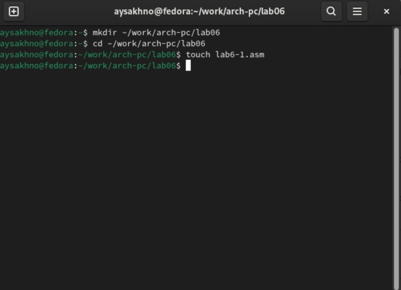{#fig:001 width=70%}

2. Рассмотрим примеры программ вывода символьных и численных значений. Програм-
мы будут выводить значения записанные в регистр eax.

Введите в файл lab6-1.asm текст программы из листинга 6.1. В данной программе в ре-гистр eax записывается символ 6 (mov eax,'6'), в регистр ebx символ 4 (mov ebx,'4').Далее к значению в регистре eax прибавляем значение регистра ebx (add eax,ebx, результат сложения запишется в регистр eax). Далее выводим результат. Так как для работы функции sprintLF в регистр eax должен быть записан адрес, необходимо использовать дополнительную переменную. Для этого запишем значение регистра eax в переменную buf1 (mov [buf1],eax), а затем запишем адрес переменной buf1 в регистр eax (mov eax,buf1) и вызовем функцию sprintLF.

(рис.2 [-@fig:002]).

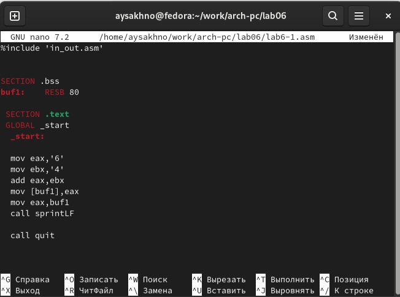{#fig:002 width=70%}

Создайте исполняемый файл и запустите его.

nasm -f elf lab6-1.asm

ld -m elf_i386 -o lab6-1 lab6-1.o

./lab6-1

(рис.3 [-@fig:003]).

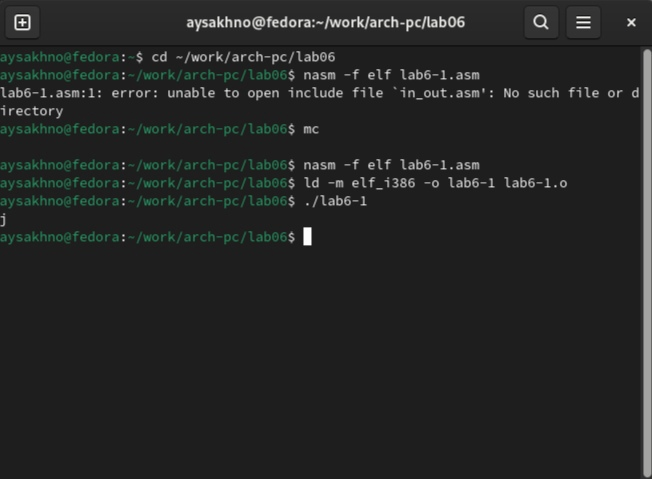{#fig:003 width=70%}

3. Далее изменим текст программы и вместо символов, запишем в регистры числа. Исправьте текст программы (Листинг 6.1) следующим образом: замените строки

mov eax,'6'
mov ebx,'4'

на строки

mov eax,6
mov ebx,4

Создайте исполняемый файл и запустите его.
Как и в предыдущем случае при исполнении программы мы не получим число 10. В данном случае выводится символ с кодом 10. Пользуясь таблицей ASCII определите какому символу соответствует код 10. Отображается ли этот символ при выводе на экран?

4. Как отмечалось выше, для работы с числами в файле in_out.asm реализованы подпрограммы для преобразования ASCII символов в числа и обратно. Преобразуем текст программы из Листинга 6.1 с использованием этих функций.
Создайте файл lab6-2.asm в каталоге ~/work/arch-pc/lab06 и введите в него текст программы из листинга 6.2.

touch ~/work/arch-pc/lab06/lab6-2.asm

(рис.4 [-@fig:004]).

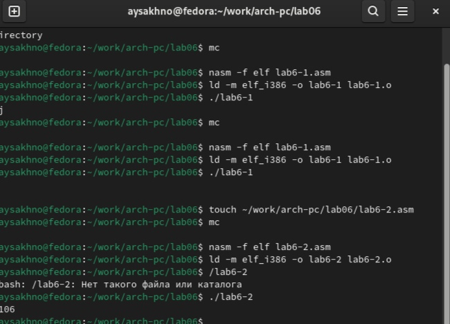{#fig:004 width=70%}

nasm -f elf lab6-2.asm

ld -m elf_i386 -o lab6-2 lab6-2.o

./lab6-2

В результате работы программы мы получим число 106. В данном случае, как и в первом, команда add складывает коды символов ‘6’ и ‘4’ (54+52=106). Однако, в отличии от программы из листинга 6.1, функция iprintLF позволяет вывести число, а не символ, кодом которого является это число.

5. Аналогично предыдущему примеру изменим символы на числа. Замените строки

mov eax,'6'
mov ebx,'4'

на строки

mov eax,6
mov ebx,4

(рис.5 [-@fig:004]).

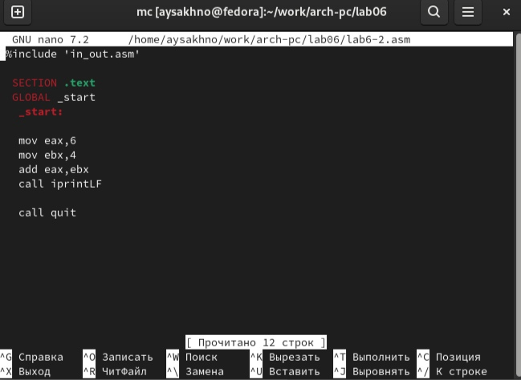{#fig:005 width=70%}

Создайте исполняемый файл и запустите его. Какой результат будет получен при исполнении программы? Замените функцию iprintLF на iprint. Создайте исполняемый файл и запустите его. Чем отличается вывод функций iprintLF и iprint?

(рис.6 [-@fig:006]).

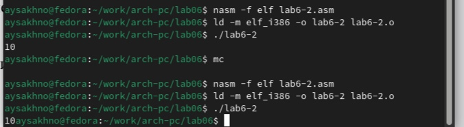{#fig:006 width=70%}

6. В качестве примера выполнения арифметических операций в NASM приведем про-
грамму вычисления арифметического выражения 𝑓(𝑥) = (5 ∗ 2 + 3)/3.

Создайте файл lab6-3.asm в каталоге ~/work/arch-pc/lab06:

touch ~/work/arch-pc/lab06/lab6-3.asm

(рис.7 [-@fig:007]).

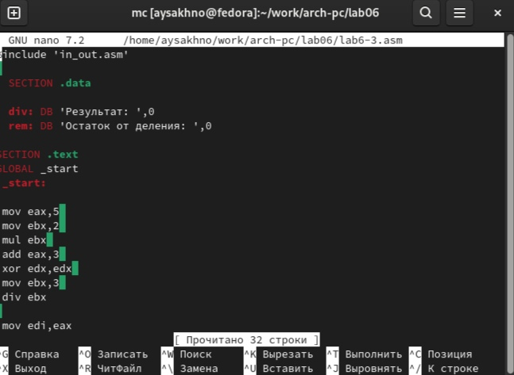{#fig:007 width=70%}

Создайте исполняемый файл и запустите его. Результат работы программы должен быть следующим:

user@dk4n31:~$ ./lab6-3

Результат: 4
Остаток от деления: 1

user@dk4n31:~$

(рис.8 [-@fig:008]).

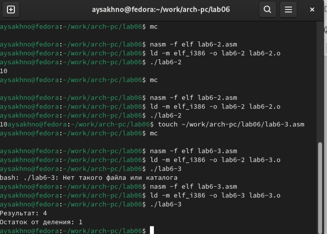{#fig:008 width=70%}

7. В качестве другого примера рассмотрим программу вычисления варианта задания по номеру студенческого билета, работающую по следующему алгоритму:

 Создайте файл variant.asm в каталоге ~/work/arch-pc/lab06:

touch ~/work/arch-pc/lab06/variant.asm

(рис.9 [-@fig:009]).

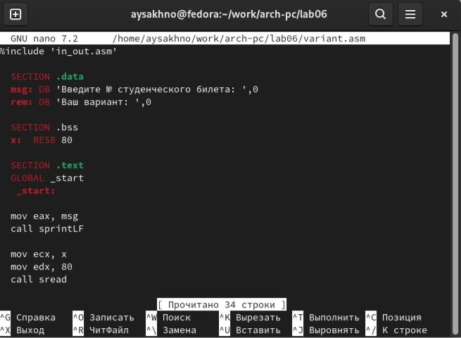{#fig:009 width=70%}

Создайте исполняемый файл и запустите его. Проверьте результат работы программы
вычислив номер варианта аналитически.

(рис.10 [-@fig:010]).

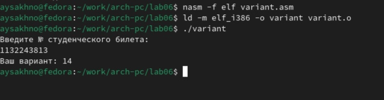{#fig:010 width=70%}

# Ответы на следующие вопросы:

1. Какие строки листинга 6.4 отвечают за вывод на экран сообщения ‘Ваш вариант:’?
Ответ: mov eax,rem
call sprint
mov eax,edx
call iprintLF
call quit

2. Для чего используется следующие инструкции?

mov ecx, x
mov edx, 80
call sread

Ответ: 1- Адрес строки х
       2- запись длины вводимого сообщения 
       3 - вызов подпрограммы ввода сообщения

3. Для чего используется инструкция “call atoi”?

Ответ: для ASCII кода в число

4. Какие строки листинга 6.4 отвечают за вычисления варианта?

Ответ: inc edx

5. В какой регистр записывается остаток от деления при выполнении инструкции “div
ebx”?
Ответ: div 
6. Для чего используется инструкция “inc edx”?
Ответ: команда inc edx уменьшает значение регистра edx на 1

7. Какие строки листинга 6.4 отвечают за вывод на экран результата вычислений?

Ответ: call sprint
mov eax,edx
call iprintLF
call quit

# Задание для самостоятельной работы

(рис.11 [-@fig:011]).

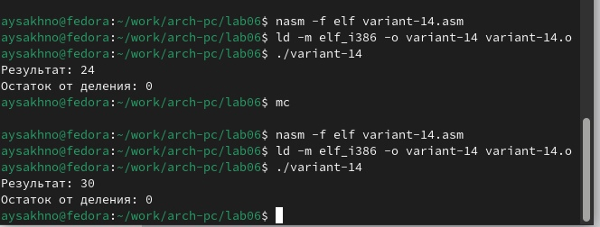{#fig:011 width=70%}

# Выводы

Я освоила арифметические инструкцие языка ассемблера NASM.

# Список литературы{.unnumbered}

::: {#refs}
::: https://esystem.rudn.ru/pluginfile.php/2089086/mod_resource/content/0/%D0%9B%D0%B0%D0%B1%D0%BE%D1%80%D0%B0%D1%82%D0%BE%D1%80%D0%BD%D0%B0%D1%8F%20%D1%80%D0%B0%D0%B1%D0%BE%D1%82%D0%B0%20%E2%84%966.%20%D0%90%D1%80%D0%B8%D1%84%D0%BC%D0%B5%D1%82%D0%B8%D1%87%D0%B5%D1%81%D0%BA%D0%B8%D0%B5%20%D0%BE%D0%BF%D0%B5%D1%80%D0%B0%D1%86%D0%B8%D0%B8%20%D0%B2%20NASM..pdf
