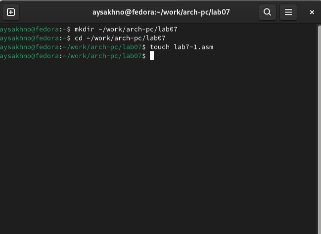
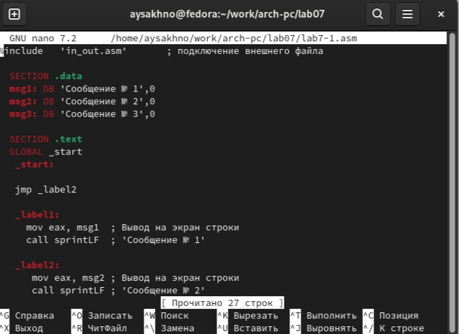
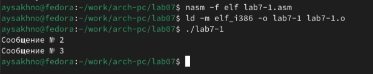
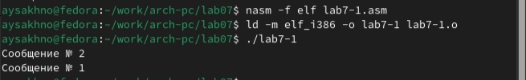
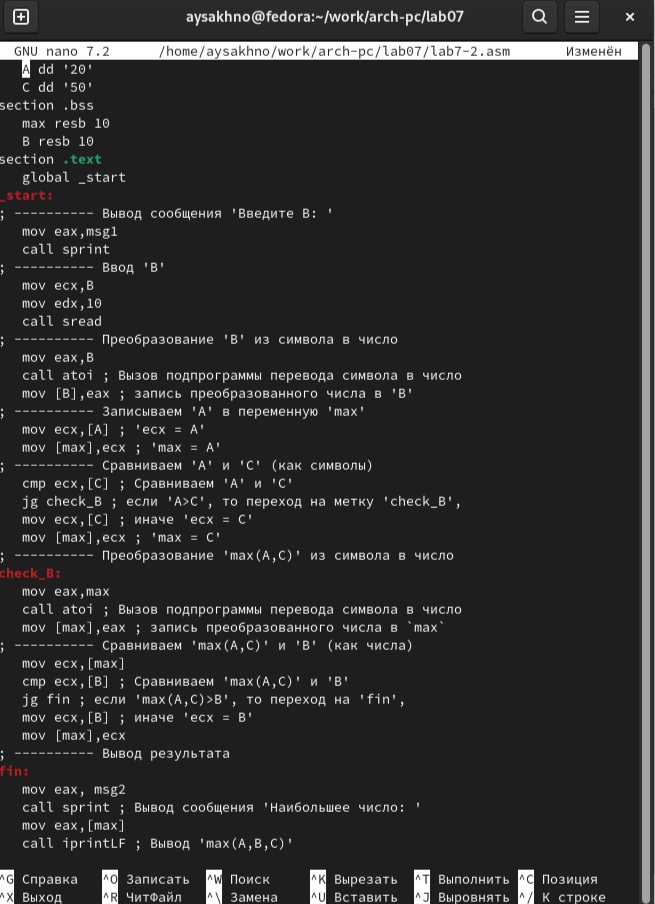
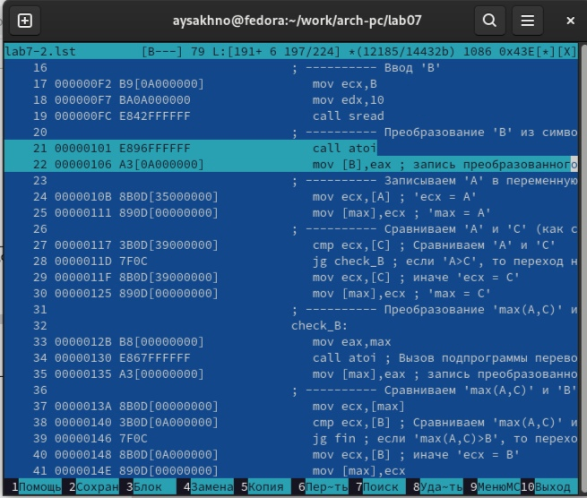
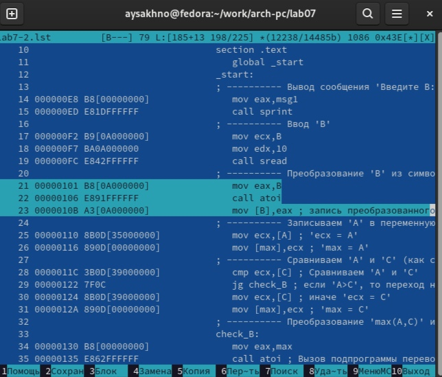
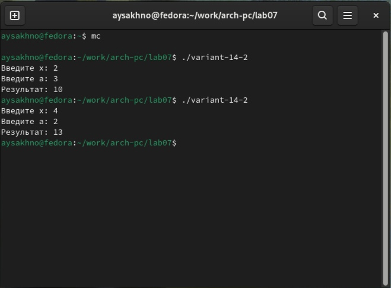

---
## Front matter
title: "Отчёт по лабораторной работе №7"
subtitle: "Простейший вариант"
author: "Сахно Алёна Юрьевна"

## Generic otions
lang: ru-RU
toc-title: "Содержание"

## Bibliography
bibliography: bib/cite.bib
csl: pandoc/csl/gost-r-7-0-5-2008-numeric.csl

## Pdf output format
toc: true # Table of contents
toc-depth: 2
lof: true # List of figures
lot: true # List of tables
fontsize: 12pt
linestretch: 1.5
papersize: a4
documentclass: scrreprt
## I18n polyglossia
polyglossia-lang:
  name: russian
  options:
	- spelling=modern
	- babelshorthands=true
polyglossia-otherlangs:
  name: english
## I18n babel
babel-lang: russian
babel-otherlangs: english
## Fonts
mainfont: IBM Plex Serif
romanfont: IBM Plex Serif
sansfont: IBM Plex Sans
monofont: IBM Plex Mono
mathfont: STIX Two Math
mainfontoptions: Ligatures=Common,Ligatures=TeX,Scale=0.94
romanfontoptions: Ligatures=Common,Ligatures=TeX,Scale=0.94
sansfontoptions: Ligatures=Common,Ligatures=TeX,Scale=MatchLowercase,Scale=0.94
monofontoptions: Scale=MatchLowercase,Scale=0.94,FakeStretch=0.9
mathfontoptions:
## Biblatex
biblatex: true
biblio-style: "gost-numeric"
biblatexoptions:
  - parentracker=true
  - backend=biber
  - hyperref=auto
  - language=auto
  - autolang=other*
  - citestyle=gost-numeric
## Pandoc-crossref LaTeX customization
figureTitle: "Рис."
tableTitle: "Таблица"
listingTitle: "Листинг"
lofTitle: "Список иллюстраций"
lotTitle: "Список таблиц"
lolTitle: "Листинги"
## Misc options
indent: true
header-includes:
  - \usepackage{indentfirst}
  - \usepackage{float} # keep figures where there are in the text
  - \floatplacement{figure}{H} # keep figures where there are in the text
---

# Цель работы

Изучение команд условного и безусловного переходов. Приобретение навыков написания
программ с использованием переходов. Знакомство с назначением и структурой файла
листинга.

# Задание

1. Теоретическое введение
2. Выполнение Лабораторной работы
3. Самостоятельная работа
4. Вывод

# Теоретическое введение

Для реализации ветвлений в ассемблере используются так называемые команды передачи управления или команды перехода. Можно выделить 2 типа переходов:

• условный переход – выполнение или не выполнение перехода в определенную точку
программы в зависимости от проверки условия.

• безусловный переход – выполнение передачи управления в определенную точку про-
граммы без каких-либо условий.

Команды безусловного перехода

Безусловный переход выполняется инструкцией jmp (от англ. jump – прыжок), которая включает в себя адрес перехода, куда следует передать управление:

jmp <адрес_перехода>

Адрес перехода может быть либо меткой, либо адресом области памяти, в которую предварительно помещен указатель перехода. Кроме того, в качестве операнда можно использовать имя регистра, в таком случае переход будет осуществляться по адресу, хранящемуся в этом регистре

В следующем примере рассмотрим использование инструкции jmp:

label:

...     ;
...     ; команды
...     ;
jmp label

Команды условного перехода

Как отмечалось выше, для условного перехода необходима проверка какого-либо условия. В ассемблере команды условного перехода вычисляют условие перехода анализируя флаги из регистра флагов.

# Выполнение лабораторной работы

Реализация переходов в NASM

1. Создайте каталог для программам лабораторной работы № 7, перейдите в него и создайте файл lab7-1.asm:

mkdir ~/work/arch-pc/lab07

cd ~/work/arch-pc/lab07

touch lab7-1.asm

(рис.1 [-@fig:001]).

{#fig:001 width=70%}

2. Инструкция jmp в NASM используется для реализации безусловных переходов. Рассмотрим пример программы с использованием инструкции jmp. Введите в файл lab7-1.asm текст программы из листинга 

(рис.2 [-@fig:002]).

{#fig:002 width=70%}

Создайте исполняемый файл и запустите его. Результат работы данной программы будет следующим:

user@dk4n31:~$ ./lab7-1

Сообщение № 2
Сообщение № 3

user@dk4n31:~$

(рис.3 [-@fig:003]).

{#fig:003 width=70%}

Таким образом, использование инструкции jmp _label2 меняет порядок исполнения
инструкций и позволяет выполнить инструкции начиная с метки _label2, пропустив вывод первого сообщения.
Инструкция jmp позволяет осуществлять переходы не только вперед но и назад. Изменим программу таким образом, чтобы она выводила сначала ‘Сообщение № 2’, потом ‘Сообщение № 1’ и завершала работу. Для этого в текст программы после вывода сообщения № 2 добавим инструкцию jmp с меткой _label1 (т.е. переход к инструкциям вывода сообщения № 1) и после вывода сообщения № 1 добавим инструкцию jmp с меткой _end (т.е. переход к инструкции call quit). Измените текст программы в соответствии с листингом

(рис.4 [-@fig:004]).

{#fig:004 width=70%}

Создайте исполняемый файл и проверьте его работу.
Измените текст программы добавив или изменив инструкции jmp, чтобы вывод программы был следующим:

user@dk4n31:~$ ./lab7-1

Сообщение № 3
Сообщение № 2
Сообщение № 1

user@dk4n31:~$

(рис.5 [-@fig:005]).

{#fig:005 width=70%}

3. Использование инструкции jmp приводит к переходу в любом случае. Однако, часто принаписании программ необходимо использовать условные переходы, т.е. переход должен происходить если выполнено какое-либо условие. В качестве примера рассмотримпрограмму, которая определяет и выводит на экран наибольшую из 3 целочисленныхпеременных: A,B и C. Значения для A и C задаются в программе, значение B вводиться склавиатуры.
Создайте файл lab7-2.asm в каталоге ~/work/arch-pc/lab07. Внимательно изучите текст программы из листинга 7.3 и введите в lab7-2.asm.

(рис.6 [-@fig:006]).

{#fig:006 width=70%}

Создайте исполняемый файл и проверьте его работу для разных значений B.
Обратите внимание, в данном примере переменные A и С сравниваются как символы, а переменная B и максимум из A и С как числа (для этого используется функция atoi преобразования символа в число). Это сделано для демонстрации того, как сравниваются данные. Данную программу можно упростить и сравнивать все 3 переменные как символы (т.е. не использовать функцию atoi). Однако если переменные преобразовать из символов числа, над ними можно корректно проводить арифметические операции.

Изучение структуры файлы листинга

4. Обычно nasm создаёт в результате ассемблирования только объектный файл. Получить файл листинга можно, указав ключ -l и задав имя файла листинга в командной строке. Создайте файл листинга для программы из файла lab7-2.asm

nasm -f elf -l lab7-2.lst lab7-2.asm

Откройте файл листинга lab7-2.lst с помощью любого текстового редактора, например mcedit:

mcedit lab7-2.lst

Внимательно ознакомиться с его форматом и содержимым. Подробно объяснить содержимое трёх строк файла листинга по выбору. Откройте файл с программой lab7-2.asm и в любой инструкции с двумя операндами удалить один операнд. Выполните трансляцию с получением файла листинга:

nasm -f elf -l lab7-2.lst lab7-2.asm

Какие выходные файлы создаются в этом случае? Что добавляется в листинге?

(рис.7 [-@fig:007]).

{#fig:007 width=70%}

(рис.8 [-@fig:008]).

{#fig:008 width=70%}

# Задание для самостоятельной работы

1. Напишите программу нахождения наименьшей из 3 целочисленных переменных 𝑎,𝑏 и . Значения переменных выбрать из табл. 7.5 в соответствии с вариантом, полученным при выполнении лабораторной работы № 7. Создайте исполняемый файл и проверьте его работу.

(рис.9 [-@fig:009]).

{#fig:009 width=70%}

2. Напишите программу, которая для введенных с клавиатуры значений 𝑥 и 𝑎 вычисляет значение заданной функции 𝑓(𝑥) и выводит результат вычислений. Вид функции 𝑓(𝑥) выбрать из таблицы 7.6 вариантов заданий в соответствии с вариантом, полученным при выполнении лабораторной работы № 7. Создайте исполняемый файл и проверьте его работу для значений 𝑥 и 𝑎 из 7.6

(рис.10 [-@fig:010]).

{#fig:010 width=70%}

# Выводы

Я изучила команды условного и безусловного переходов. Приобрела навыков написания программ с использованием переходов. Познакомилась с назначением и структурой файла листинга.

# Список литературы{.unnumbered}

::: {#refs}
:::https://esystem.rudn.ru/pluginfile.php/2089087/mod_resource/content/0
