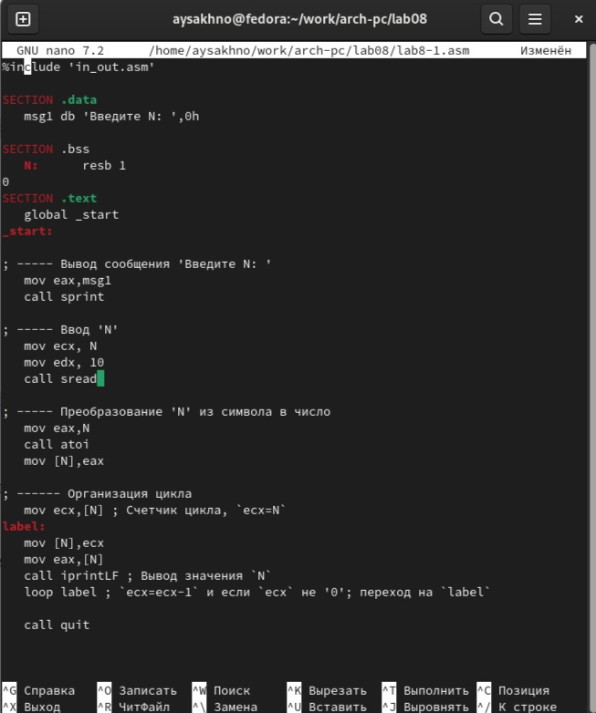
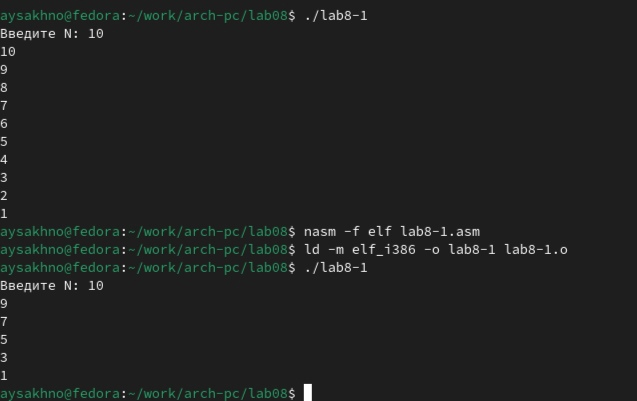
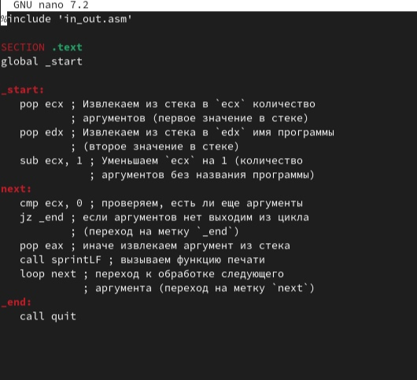
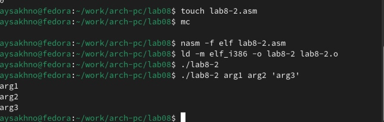
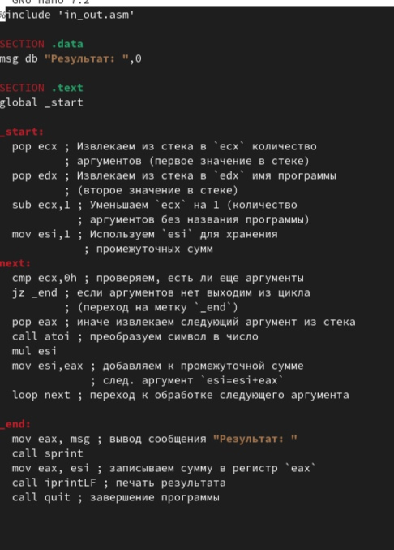
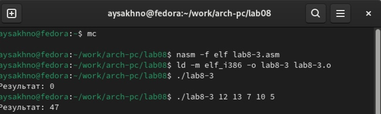
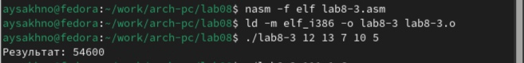
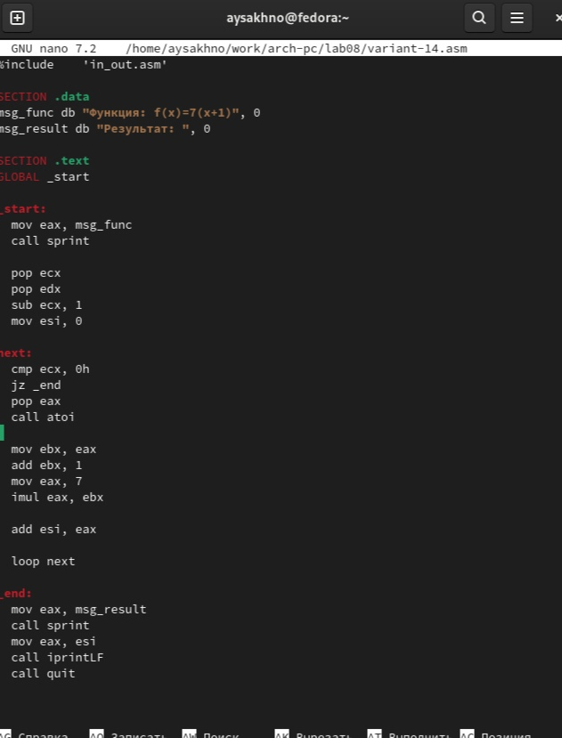
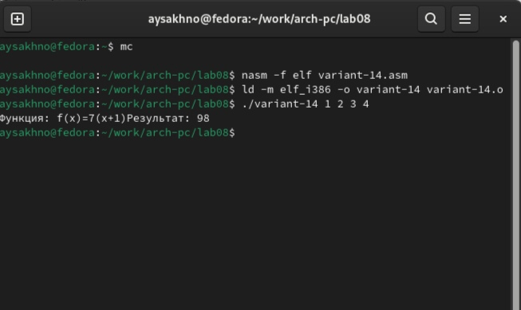

---
## Front matter
title: "Отчёт по лабораторной работе № 8"
subtitle: "Простейший вариант"
author: "Сахно Алёна Юрьевна "

## Generic otions
lang: ru-RU
toc-title: "Содержание"

## Bibliography
bibliography: bib/cite.bib
csl: pandoc/csl/gost-r-7-0-5-2008-numeric.csl

## Pdf output format
toc: true # Table of contents
toc-depth: 2
lof: true # List of figures
lot: true # List of tables
fontsize: 12pt
linestretch: 1.5
papersize: a4
documentclass: scrreprt
## I18n polyglossia
polyglossia-lang:
  name: russian
  options:
	- spelling=modern
	- babelshorthands=true
polyglossia-otherlangs:
  name: english
## I18n babel
babel-lang: russian
babel-otherlangs: english
## Fonts
mainfont: IBM Plex Serif
romanfont: IBM Plex Serif
sansfont: IBM Plex Sans
monofont: IBM Plex Mono
mathfont: STIX Two Math
mainfontoptions: Ligatures=Common,Ligatures=TeX,Scale=0.94
romanfontoptions: Ligatures=Common,Ligatures=TeX,Scale=0.94
sansfontoptions: Ligatures=Common,Ligatures=TeX,Scale=MatchLowercase,Scale=0.94
monofontoptions: Scale=MatchLowercase,Scale=0.94,FakeStretch=0.9
mathfontoptions:
## Biblatex
biblatex: true
biblio-style: "gost-numeric"
biblatexoptions:
  - parentracker=true
  - backend=biber
  - hyperref=auto
  - language=auto
  - autolang=other*
  - citestyle=gost-numeric
## Pandoc-crossref LaTeX customization
figureTitle: "Рис."
tableTitle: "Таблица"
listingTitle: "Листинг"
lofTitle: "Список иллюстраций"
lotTitle: "Список таблиц"
lolTitle: "Листинги"
## Misc options
indent: true
header-includes:
  - \usepackage{indentfirst}
  - \usepackage{float} # keep figures where there are in the text
  - \floatplacement{figure}{H} # keep figures where there are in the text
---

# Цель работы

Приобретение навыков написания программ с использованием циклов и обработкой
аргументов командной строки.

# Задание

1. Теоретическая часть 
2. Задачи для самостоятельной работы 
3. Варианты заданий

# Теоретическая часть 

8.2.1. Организация стека

Стек — это структура данных, организованная по принципу LIFO («Last In — First Out»
или «последним пришёл — первым ушёл»). Стек является частью архитектуры процессора и
реализован на аппаратном уровне. Для работы со стеком в процессоре есть специальные
регистры (ss, bp, sp) и команды.
Основной функцией стека является функция сохранения адресов возврата и передачи
аргументов при вызове процедур. Кроме того, в нём выделяется память для локальных
переменных и могут временно храниться значения регистров.
На рис. 8.1 показана схема организации стека в процессоре.
Стек имеет вершину, адрес последнего добавленного элемента, который хранится в ре-
гистре esp (указатель стека). Противоположный конец стека называется дном. Значение,
помещённое в стек последним, извлекается первым. При помещении значения в стек указа-
тель стека уменьшается, а при извлечении — увеличивается.
Для стека существует две основные операции:

• добавление элемента в вершину стека (push);
• извлечение элемента из вершины стека (pop).

8.1. Добавление элемента в стек.

Команда push размещает значение в стеке, т.е. помещает значение в ячейку памяти, на
которую указывает регистр esp, после этого значение регистра esp увеличивается на 4.
Данная команда имеет один операнд — значение, которое необходимо поместить в стек.
Примеры:

push -10 ; Поместить -10 в стек
push ebx ; Поместить значение регистра ebx в стек
push [buf] ; Поместить значение переменной buf в стек
push word [ax] ; Поместить в стек слово по адресу в ax

Существует ещё две команды для добавления значений в стек. Это команда pusha, которая
помещает в стек содержимое всех регистров общего назначения в следующем порядке: ах, сх, dx, bх, sp, bp, si, di. А также команда pushf, которая служит для перемещения в стек содержимого регистра флагов. Обе эти команды не имеют операндов.

#Выполнение самостоятельной работы 

8.3. Реализация циклов в NASM

Создайте каталог для программам лабораторной работы № 8, перейдите в него и создайте файл lab8-1.asm:

mkdir ~/work/arch-pc/lab08
cd ~/work/arch-pc/lab08
touch lab8-1.asm

При реализации циклов в NASM с использованием инструкции loop необходимо помнить
о том, что эта инструкция использует регистр ecx в качестве счетчика и на каждом шаге уменьшает его значение на единицу. В качестве примера рассмотрим программу, которая выводит значение регистра ecx. Внимательно изучите текст программы (Листинг 8.1).
Листинг 8.1. Программа вывода значений регистра ecx
(рис. [-@fig:001]).

{#fig:001 width=70%}

Введите в файл lab8-1.asm текст программы из листинга 8.1. Создайте исполняемый файл и проверьте его работу. Данный пример показывает, что использование регистра ecx в теле цилка loop может привести к некорректной работе программы. Измените текст программы добавив изменение значение регистра ecx в цикле:

label:
sub ecx,1 ; `ecx=ecx-1`
mov [N],ecx
mov eax,[N]
call iprintLF

(рис. [-@fig:002]).

{#fig:002 width=70%}
Архитектура ЭВМ

loop label

Создайте исполняемый файл и проверьте его работу. Какие значения принимает регистр ecx в цикле? Соответствует ли число проходов цикла значению 𝑁 введенному с клавиатуры?

Для использования регистра ecx в цикле и сохранения корректности работы программы можно использовать стек. Внесите изменения в текст программы добавив команды push и pop (добавления в стек и извлечения из стека) для сохранения значения счетчика цикла loop:

label:
push ecx ; добавление значения ecx в стек
sub ecx,1
mov [N],ecx
mov eax,[N]
call iprintLF
pop ecx ; извлечение значения ecx из стека
loop label

Создайте исполняемый файл и проверьте его работу. Соответствует ли в данном случае число проходов цикла значению 𝑁 введенному с клавиатуры?

(рис. [-@fig:003]).

{#fig:003 width=70%}

Архитектура ЭВМ
loop label
Создайте исполняемый файл и проверьте его работу. Какие значения принимает регистр
ecx в цикле? Соответствует ли число проходов цикла значению 𝑁 введенному с клавиатуры?
Для использования регистра ecx в цикле и сохранения корректности работы программы
можно использовать стек. Внесите изменения в текст программы добавив команды push
и pop (добавления в стек и извлечения из стека) для сохранения значения счетчика цикла
loop:
label:
push ecx ; добавление значения ecx в стек
sub ecx,1
mov [N],ecx
mov eax,[N]
call iprintLF
pop ecx ; извлечение значения ecx из стека
loop label
Создайте исполняемый файл и проверьте его работу. Соответствует ли в данном случае
число проходов цикла значению 𝑁 введенному с клавиатуры?

8.3.2. Обработка аргументов командной строки

При разработке программ иногда встает необходимость указывать аргументы, которые
будут использоваться в программе, непосредственно из командной строки при запуске программы. При запуске программы в NASM аргументы командной строки загружаются в стек в обратном порядке, кроме того в стек записывается имя программы и общее количество аргументов.Последние два элемента стека для программы, скомпилированной NASM, – это всегда имя программы и количество переданных аргументов. Таким образом, для того чтобы использовать аргументы в программе, их просто нужно извлечь из стека. Обработку аргументов нужно проводить в цикле. Т.е. сначала нужно извлечь из стека количество аргументов, а затем циклично для каждого аргумента выполнить логику программы. В качестве примера рассмотрим программу, которая выводит на экран аргументы командной строки. Внимательно изучите текст программы (Листинг 8.2). 

(рис. [-@fig:004]).

{#fig:004 width=70%}

Создайте файл lab8-2.asm в каталоге ~/work/arch-pc/lab08 и введите в него текст программы из листинга 8.2. Создайте исполняемый файл и запустите его, указав аргументы:
user@dk4n31:~$ ./lab8-2 аргумент1 аргумент 2 'аргумент 3'

Сколько аргументов было обработано программой?

(рис. [-@fig:005]).

{#fig:005 width=70%}

Рассмотрим еще один пример программы которая выводит сумму чисел, которые пере-
даются в программу как аргументы. Создайте файл lab8-3.asm в каталоге ~/work/arch-pc/lab08 и введите в него текст программы из листинга 8.3.

(рис. [-@fig:006]).

{#fig:006 width=70%}

Cоздайте исполняемый файл и запустите его, указав аргументы. Пример результата работы программы:

user@dk4n31:~$ ./main 12 13 7 10 5
Результат: 47
user@dk4n31:~$

(рис. [-@fig:007]).

{#fig:007 width=70%}

Измените текст программы из листинга 8.3 для вычисления произведения аргументов
командной строки.

(рис. [-@fig:008]).

{#fig:008 width=70%}

# Задание для самостоятельной работы

1. Напишите программу, которая находит сумму значений функции f(x) для
x = x1, x2, ..., xn, т.е. программа должна выводить значение f(x1) + f(x2) + ... + f(xn). Значения 𝑥𝑖 передаются как аргументы. Вид функции f(x) выбрать из таблицы
8.1 вариантов заданий в соответствии с вариантом, полученным при выполнении
лабораторной работы № 7. Создайте исполняемый файл и проверьте его работу на
нескольких наборах x = x1, x2, ..., xn

Пример работы программы для функции f(х) = х + 2 и набора x1 = 1, x2 = 2, x3 = 3,
x4 = 4:

user@dk4n31:~$ ./main 1 2 3 4

Функция: f(x)=x+2

Результат: 18

user@dk4n31:~$

(рис. [-@fig:009]).

{#fig:009 width=70%}

(рис. [-@fig:010]).

{#fig:010 width=70%}

# Выводы

Я приобрела навык написания программ с использованием циклов и обработкой
аргументов командной строки.

# Список литературы{.unnumbered}

::: {#refs}
:::https://esystem.rudn.ru/pluginfile.php/2089095/mod_resource/content
