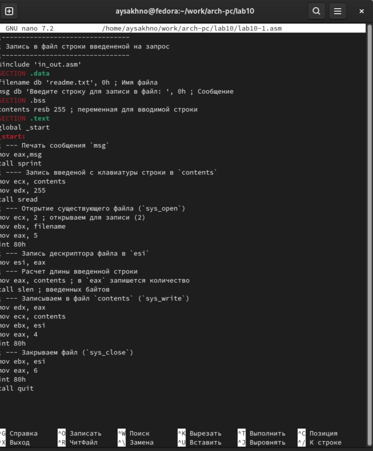
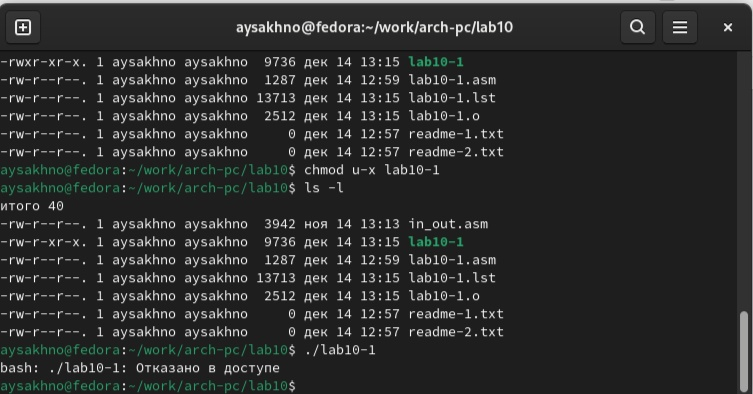

---
## Front matter
title: " Отчёта по лабораторной работе №10 "
subtitle: "Простейший вариант"
author: "Сахно Алёна Юрьевна"

## Generic otions
lang: ru-RU
toc-title: "Содержание"

## Bibliography
bibliography: bib/cite.bib
csl: pandoc/csl/gost-r-7-0-5-2008-numeric.csl

## Pdf output format
toc: true # Table of contents
toc-depth: 2
lof: true # List of figures
lot: true # List of tables
fontsize: 12pt
linestretch: 1.5
papersize: a4
documentclass: scrreprt
## I18n polyglossia
polyglossia-lang:
  name: russian
  options:
	- spelling=modern
	- babelshorthands=true
polyglossia-otherlangs:
  name: english
## I18n babel
babel-lang: russian
babel-otherlangs: english
## Fonts
mainfont: IBM Plex Serif
romanfont: IBM Plex Serif
sansfont: IBM Plex Sans
monofont: IBM Plex Mono
mathfont: STIX Two Math
mainfontoptions: Ligatures=Common,Ligatures=TeX,Scale=0.94
romanfontoptions: Ligatures=Common,Ligatures=TeX,Scale=0.94
sansfontoptions: Ligatures=Common,Ligatures=TeX,Scale=MatchLowercase,Scale=0.94
monofontoptions: Scale=MatchLowercase,Scale=0.94,FakeStretch=0.9
mathfontoptions:
## Biblatex
biblatex: true
biblio-style: "gost-numeric"
biblatexoptions:
  - parentracker=true
  - backend=biber
  - hyperref=auto
  - language=auto
  - autolang=other*
  - citestyle=gost-numeric
## Pandoc-crossref LaTeX customization
figureTitle: "Рис."
tableTitle: "Таблица"
listingTitle: "Листинг"
lofTitle: "Список иллюстраций"
lotTitle: "Список таблиц"
lolTitle: "Листинги"
## Misc options
indent: true
header-includes:
  - \usepackage{indentfirst}
  - \usepackage{float} # keep figures where there are in the text
  - \floatplacement{figure}{H} # keep figures where there are in the text
---

# Цель работы
Приобретение навыков написания программ для работы с файлами.
# Задание
1. Теоретическая часть 
2. Выполнения лабораторной работы
3. Выполнение самостоятельной работы 

# Теоретическое введение

10.2. Теоретическое введение

10.2.1. Права доступа к файлам

ОС GNU/Linux является многопользовательской операционной системой. И для обеспече-
ния защиты данных одного пользователя от действий других пользователей существуют
специальные механизмы разграничения доступа к файлам. Кроме ограничения доступа, дан-
ный механизм позволяет разрешить другим пользователям доступ данным для совместной
работы.
Права доступа определяют набор действий (чтение, запись, выполнение), разрешённых
для выполнения пользователям системы над файлами. Для каждого файла пользователь
может входить в одну из трех групп: владелец, член группы владельца, все остальные. Для
каждой из этих групп может быть установлен свой набор прав доступа. Владельцем файла
является его создатель. Для предоставления прав доступа другому пользователю или другой
группе командой
chown [ключи] <новый_пользователь>[:новая_группа] <файл>
или
chgrp [ключи] < новая_группа > <файл>
Набор прав доступа задается тройками битов и состоит из прав на чтение, запись и ис-
полнение файла. В символьном представлении он имеет вид строк rwx, где вместо любого
символа может стоять дефис. Всего возможно 8 комбинаций, приведенных в таблице 10.1.
Буква означает наличие права (установлен в единицу второй бит триады r — чтение, первый
бит w — запись, нулевой бит х — исполнение), а дефис означает отсутствие права (нулевое
значение соответствующего бита). Также права доступа могут быть представлены как вось-
меричное число. Так, права доступа rw- (чтение и запись, без исполнения) понимаются как
три двоичные цифры 110 или как восьмеричная цифра 6.

Полная строка прав доступа в символьном представлении имеет вид:
<права_владельца> <права_группы> <права_остальных>
Так, например, права rwx r-x --x выглядят как двоичное число 111 101 001, или вось-
меричное 751.
Свойства (атрибуты) файлов и каталогов можно вывести на терминал с помощью команды
ls с ключом -l. Так например, чтобы узнать права доступа к файлу README можно узнать с
помощью следующей команды:
$ls -l /home/debugger/README
-rwxr-xr-- 1 debugger users 0 Feb 14 19:08 /home/debugger/README
В первой колонке показаны текущие права доступа, далее указан владелец файла и группа:
Тип файла определяется первой позицией, это может быть: каталог — d, обычный файл
— дефис (-) или символьная ссылка на другой файл — l. Следующие 3 набора по 3 символа
определяют конкретные права для конкретных групп: r — разрешено чтение файла, w —
разрешена запись в файл; x — разрешено исполнение файл и дефис (-) — право не дано.
Для изменения прав доступа служит команда chmod, которая понимает как символьное,
так и числовое указание прав. Для того чтобы назначить файлу /home/debugger/README
права rw-r, то есть разрешить владельцу чтение и запись, группе только чтение, остальным пользователям — ничего:

$chmod 640 README # 110 100 000 == 640 == rw-r-----
$ls -l README
-rw-r 1 debugger users 0 Feb 14 19:08 /home/debugger/README

В символьном представлении есть возможность явно указывать какой группе какие права
необходимо добавить, отнять или присвоить. Например, чтобы добавить право на исполнение файла README группе и всем остальным:

$chmod go+x README
$ls -l README
-rw-r-x--x 1 debugger users 0 Feb 14 19:08 /home/debugger/README

Формат символьного режима:
chmod <категория><действие><набор_прав><файл>
Возможные значения аргументов команды представлены в таблице 10.2
Общий алгоритм работы с системными вызовами в Nasm можно представить в следующем
виде:
1. Поместить номер системного вызова в регистр EAX;
2. Поместить аргументы системного вызова в регистрах EBX, ECX и EDX;
3. Вызов прерывания (int 80h);
4. Результат обычно возвращается в регистр EAX.
# Выполнение лабораторной работы
1. Создайте каталог для программам лабораторной работы № 10, перейдите в него и
создайте файлы lab10-1.asm, readme-1.txt и readme-2.txt:

mkdir ~/work/arch-pc/lab09
cd ~/work/arch-pc/lab09
touch lab10-1.asm readme-1.txt readme-2.txt

(рис.1 [-@fig:001]).

{#fig:001 width=70%}

2. Введите в файл lab10-1.asm текст программы из листинга 10.1 (Программа записи в
файл сообщения). Создайте исполняемый файл и проверьте его работу.

(рис.2 [-@fig:002]).

{#fig:002 width=70%}

3. С помощью команды chmod измените права доступа к исполняемому файлу lab10-1,
запретив его выполнение. Попытайтесь выполнить файл. Объясните результат.

(рис. [-@fig:003]).

{#fig:003 width=70%}

4. С помощью команды chmod измените права доступа к файлу lab10-1.asm с исходным
текстом программы, добавив права на исполнение. Попытайтесь выполнить его и
объясните результат.

(рис.4 [-@fig:004]).

{#fig:004 width=70%}

5. В соответствии с вариантом в таблице 10.4 предоставить права доступа к файлу readme-1.txt представленные в символьном виде, а для файла readme-2.txt – в двочном виде.Проверить правильность выполнения с помощью команды ls -l.

 (рис.5 [-@fig:005]).

{#fig:005 width=70%}

У меня вариант 14 r-x rwx rwx 110 111 110

# Выводы
Я приобрела навык написания программ для работы с файлами.

# Список литературы{.unnumbered}

::: {#refs}
:::
